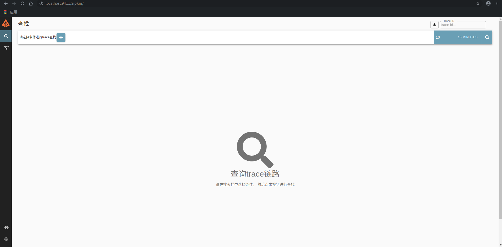
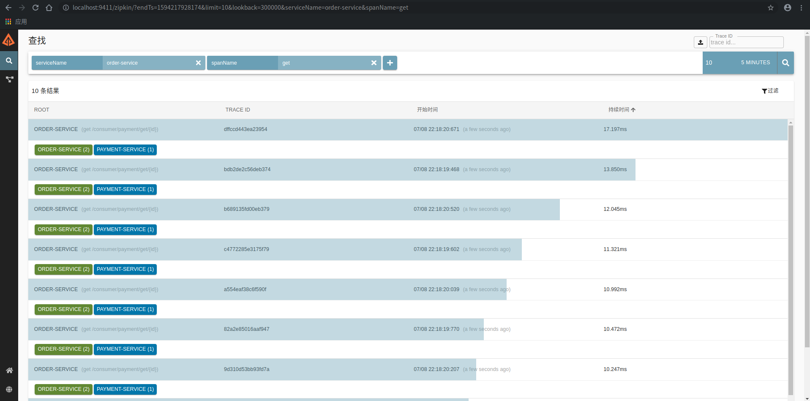
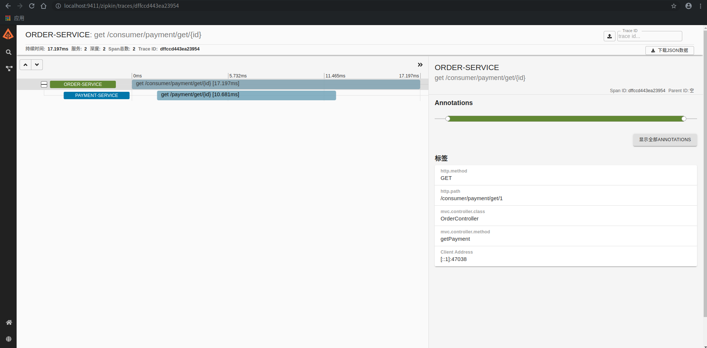

# SpringCloudLearn
SpringCloud学习项目

- [SpringCloudLearn](#springcloudlearn)
  * [要点](#要点)
    + [ribbon服务调用负载均衡](#ribbon服务调用负载均衡)
      - [1.ribbon的核心是接口IRule](#1.ribbon的核心是接口IRule)
      - [2.手写LB算法](#2.手写LB算法)
    + [Feign/OpenFeign服务调用](#feign/OpenFeign服务调用)
    + [Hystrix服务降级](#Hystrix服务降级)
      - [Hystrix-Dashboard](#Hystrix-Dashboard)
    + [Gateway服务网关](#Gateway服务网关)
      - [gateway动态路由](#gateway动态路由)
      - [predicate断言/谓语](#predicate断言/谓语)
      - [Filter过滤器](#Filter过滤器)
    + [springcloudConfig配置中心](#springcloudConfig配置中心)
      - [springcloudConfigClient](#springcloudConfigClient)
      - [config-client配置动态刷新](#config-client配置动态刷新)
    + [springcloudbus消息总线](#springcloudbus消息总线)
      - [两种思路：](#两种思路：)
      - [实现方法](#实现方法)
      - [实现差异化更新配置](#实现差异化更新配置)
    + [spring-cloud-stream](#spring-cloud-stream)
      - [springcloud-stream流程](#springcloud-stream流程)
      - [使用方法](#使用方法)
      - [集群重复消费问题](#-集群重复消费问题)
      - [SpringCloud-stream消息持久化](#springcloud-stream消息持久化)
    + [springcloud-Sleuth分布式请求链路跟踪](#springcloud-Sleuth分布式请求链路跟踪)
    + [springcloud-alibaba](#springcloud-alibaba)
      - [Nacos注册中心配置中心](#Nacos注册中心配置中心)

<small><i><a href='http://ecotrust-canada.github.io/markdown-toc/'>Table of contents generated with markdown-toc</a></i></small>


## 要点
### ribbon服务调用负载均衡
#### 1.ribbon的核心是接口IRule

```java
package com.evil.loadbalancerule;

import com.netflix.loadbalancer.IRule;
import com.netflix.loadbalancer.RandomRule;
import org.springframework.context.annotation.Bean;
import org.springframework.context.annotation.Configuration;

@Configuration
public class MyRule {
    @Bean
    public IRule myselfRule() {
        return new RandomRule();
    }
}
```
ribbon官方文档指出自定义的均衡负载不能在@ComponentScan能扫描到的地方，@SpringBootApplication其实就包含了@ComponentScan，所以要在主启动类所在包之外，新增一个package

#### 2.手写LB算法
通过DiscoveryClient可以获取服务实例，自己写算法得到服务实例进行调用即可。

```java
@Configuration
public class MyRule {
    @Resource
    private DiscoveryClient discoveryClient;

    @GetMapping("/payment/discovery")
    public Object discovery() {
        List<String> services = discoveryClient.getServices();

        for (String service : services) {
            log.info("####service: " + service);
            List<ServiceInstance> instances = discoveryClient.getInstances(service);
            for (ServiceInstance instance : instances) {
                log.info(instance.getServiceId() + "\t" + instance.getHost() + "\t" + instance.getPort() + "\t" + instance.getUri());
            }
        }
        return this.discoveryClient;
    }
}
```

### Feign/OpenFeign服务调用

一个生命式的Web服务客户端，让编写Web服务客户端变得容易，只需要创建一个接口并在接口上添加注释即可

主启动类增加@EnableFeignClients，接口增加@FeignClient，实现调用。

```java
package com.evil.cloud.service;

import com.evil.cloud.entities.CommonResult;
import com.evil.cloud.entities.Payment;
import org.springframework.cloud.openfeign.FeignClient;
import org.springframework.stereotype.Component;
import org.springframework.web.bind.annotation.GetMapping;
import org.springframework.web.bind.annotation.PathVariable;

@Component
@FeignClient(value = "PAYMENT-SERVICE")
public interface PaymentFeignService {

    @GetMapping(value = "/payment/get/{id}")
    CommonResult<Payment> getPaymentById(@PathVariable("id") Long id);
}

```

OpenFeign自带均衡负载

面向接口开发，类似于mybatis的mapper接口

openfeign默认1s超时，超市报错

feign底层还是ribbon和restTemplate，调用超时时间配置：
```yaml
ribbon:
  ReadTimeout: 5000 #建立连接后读取的超时时间 socketTimeout
  ConnectTimeout: 5000  #建立连接超时时间 connectTimeout
```

feign日志：
1. NONE
2. BASIC
3. HEADERS
4. FULL

```java
package com.evil.cloud.config;

import feign.Logger;
import org.springframework.context.annotation.Bean;
import org.springframework.context.annotation.Configuration;

/**
 * feign日志配置类
 */
@Configuration
public class FeignConfig {
    @Bean
    Logger.Level feignLoggerLevel() {
        return Logger.Level.FULL;
    }
}
```

```yaml
logging:
  level:
    com.evil.cloud.serive.PaymentFeignService: debug  #feigin日志以什么级别监控哪个接口
```
日志如下
```text
2020-05-06 20:31:56.477 DEBUG 18256 --- [p-nio-80-exec-1] c.e.cloud.service.PaymentFeignService    : [PaymentFeignService#getPaymentById] <--- HTTP/1.1 200 (368ms)
2020-05-06 20:31:56.477 DEBUG 18256 --- [p-nio-80-exec-1] c.e.cloud.service.PaymentFeignService    : [PaymentFeignService#getPaymentById] connection: keep-alive
2020-05-06 20:31:56.477 DEBUG 18256 --- [p-nio-80-exec-1] c.e.cloud.service.PaymentFeignService    : [PaymentFeignService#getPaymentById] content-type: application/json
2020-05-06 20:31:56.477 DEBUG 18256 --- [p-nio-80-exec-1] c.e.cloud.service.PaymentFeignService    : [PaymentFeignService#getPaymentById] date: Wed, 06 May 2020 12:31:56 GMT
2020-05-06 20:31:56.478 DEBUG 18256 --- [p-nio-80-exec-1] c.e.cloud.service.PaymentFeignService    : [PaymentFeignService#getPaymentById] keep-alive: timeout=60
2020-05-06 20:31:56.478 DEBUG 18256 --- [p-nio-80-exec-1] c.e.cloud.service.PaymentFeignService    : [PaymentFeignService#getPaymentById] transfer-encoding: chunked
2020-05-06 20:31:56.478 DEBUG 18256 --- [p-nio-80-exec-1] c.e.cloud.service.PaymentFeignService    : [PaymentFeignService#getPaymentById] 
2020-05-06 20:31:56.479 DEBUG 18256 --- [p-nio-80-exec-1] c.e.cloud.service.PaymentFeignService    : [PaymentFeignService#getPaymentById] {"code":200,"message":"查询成功，serverPort：8002","data":{"id":1,"serial":"111"}}
2020-05-06 20:31:56.480 DEBUG 18256 --- [p-nio-80-exec-1] c.e.cloud.service.PaymentFeignService    : [PaymentFeignService#getPaymentById] <--- END HTTP (88-byte body)
```

### Hystrix服务降级

服务雪崩：多个微服务之间存在多级调用关系，也就是所谓的“扇出”，如果扇出的链路上某个服务响应时间过长或者不可用，对越靠近源头的服务影响越大，占用越来越多的系统资源，进而引起系统崩溃，整个系统也会发生级联故障。

Hystrix是一个用于处理分布式系统的延迟和容错的开源组件。Hystrix能够保证在一个依赖服务出现问题的情况下，不会导致整体服务失败，避免级联故障，以提高分布式系统的弹性。

“断路器”：当某个服务单元发生故障后，通过断路器的故障监控，向调用方返回一个符合预期的、可处理的备选相应，而不是长时间的等待或者抛出调用方无法处理的异常，这样就保证了服务调用方线程不会长时间、不必要的占用，从而避免故障在分布式系统中的蔓延，乃至雪崩。

**重要概念：**

- 服务降级：返回一个友好的提示，不让客户端等待。程序运行异常、超时、服务熔断触发服务降级、线程池/信号量打满等都会导致服务降级。
- 服务熔断：访问量过大，直接拒绝访问，然后通过服务降级返回友好提示
- 服务限流：秒杀等高并发场景，防止流量全部进来

1. 在需要熔断处理的方法加上@HystrixCommand，并注明熔断后处理的方法。
2. 在主启动类启用熔断器@EnableCircuitBreaker


```java
    @HystrixCommand(fallbackMethod = "calErrorHystrixHandler")
    public String calErrorHystrix() {
        int i = 1/0; //报错触发服务降级
        return "success";
    }

    public String calErrorHystrixHandler() {
        return "hystrix";
    }
```

默认fallbackMethod，在类上加注解：@DefaultProperties(defaultFallback = "fallback-method-name")

这样的话，如果没有加fallbackMethod的@HystrixCommand，就会使用这个默认的降级方法来处理。

当然这里也是就近原则， 如果在方法上标注了， 还是按方法上的来。

另外一个同意配置fallbackMethod的方法是：开启feign自带的hystrix，在配置中加入：

```YML
feign:
  hystrix:
    enabled: true
```

然后写一个类比如叫XXXFallbackService来实现我们的FeignClient-XXXService，在实现方法里写对应的降级操作。然后将这个降级service加到IOC容器，在feignClient配置fallback，指向这个类，那么对应的方法就作为feign调用失败的fallback。

```java
package com.evil.cloud.hystrix;

import com.evil.cloud.entities.CommonResult;
import com.evil.cloud.service.PaymentFeignService;
import org.springframework.stereotype.Component;

@Component
public class PaymentHystrixService implements PaymentFeignService {
    @Override
    public CommonResult getPaymentById(Long id) {
        return new CommonResult(888, "global hystrix，查询ID=" + id, null);
    }

    @Override
    public CommonResult getPaymentByIdTimeout(Long id) {
        return new CommonResult(888, "global hystrix，查询ID=" + id, null);
    }
}

```

```java
package com.evil.cloud.service;

import com.evil.cloud.config.FeignConfig;
import com.evil.cloud.entities.CommonResult;
import com.evil.cloud.entities.Payment;
import com.evil.cloud.hystrix.PaymentHystrixService;
import org.springframework.cloud.openfeign.FeignClient;
import org.springframework.stereotype.Component;
import org.springframework.web.bind.annotation.GetMapping;
import org.springframework.web.bind.annotation.PathVariable;

@Component
@FeignClient(value = "PAYMENT-HYSTRIX-SERVICE", fallback = PaymentHystrixService.class)
public interface PaymentFeignService {

    @GetMapping(value = "/payment/get/{id}")
    CommonResult getPaymentById(@PathVariable("id") Long id);

    @GetMapping(value = "/payment/getTimeout/{id}")
    CommonResult getPaymentByIdTimeout(@PathVariable("id") Long id);
}

```

熔断器：配置熔断器，有默认值的

```
@HystrixCommand(fallbackMethod = "paymentCircuitBreakerFallback", commandProperties = {
            @HystrixProperty(name = "circuitBreaker.enabled", value = "true"), //是否开启熔断器
            @HystrixProperty(name = "circuitBreaker.requestVolumeThreshold", value = "10"), //请求次数
            @HystrixProperty(name = "circuitBreaker.sleepWindowInMilliseconds", value = "10000"), //时间窗口期
            @HystrixProperty(name = "circuitBreaker.errorThresholdPercentage", value = "60")    //失败率到达多少后跳闸
            //上面的配置就是----如果10次失败率达到60%就开启熔断，10s后开始尝试让下一个请求通过（半开），如果失败了，就保持开启熔断器，等过10s再试试，如果成功了，就关闭熔断器
    })
```

抽象类`HystrixCommandProperties`里设置了所有properties的默认值：
```java
public abstract class HystrixCommandProperties {
    private static final Logger logger = LoggerFactory.getLogger(HystrixCommandProperties.class);
    static final Integer default_metricsRollingStatisticalWindow = 10000;
    private static final Integer default_metricsRollingStatisticalWindowBuckets = 10;
    private static final Integer default_circuitBreakerRequestVolumeThreshold = 20;
    private static final Integer default_circuitBreakerSleepWindowInMilliseconds = 5000;
    private static final Integer default_circuitBreakerErrorThresholdPercentage = 50;
    private static final Boolean default_circuitBreakerForceOpen = false;
    static final Boolean default_circuitBreakerForceClosed = false;
    private static final Integer default_executionTimeoutInMilliseconds = 1000;
    private static final Boolean default_executionTimeoutEnabled = true;
    private static final HystrixCommandProperties.ExecutionIsolationStrategy default_executionIsolationStrategy;
    private static final Boolean default_executionIsolationThreadInterruptOnTimeout;
    private static final Boolean default_executionIsolationThreadInterruptOnFutureCancel;
    private static final Boolean default_metricsRollingPercentileEnabled;
    private static final Boolean default_requestCacheEnabled;
    private static final Integer default_fallbackIsolationSemaphoreMaxConcurrentRequests;
    private static final Boolean default_fallbackEnabled;
    private static final Integer default_executionIsolationSemaphoreMaxConcurrentRequests;
    private static final Boolean default_requestLogEnabled;
    private static final Boolean default_circuitBreakerEnabled;
    private static final Integer default_metricsRollingPercentileWindow;
    private static final Integer default_metricsRollingPercentileWindowBuckets;
    private static final Integer default_metricsRollingPercentileBucketSize;
    private static final Integer default_metricsHealthSnapshotIntervalInMilliseconds;
    private final HystrixCommandKey key;
    private final HystrixProperty<Integer> circuitBreakerRequestVolumeThreshold;
    private final HystrixProperty<Integer> circuitBreakerSleepWindowInMilliseconds;
    private final HystrixProperty<Boolean> circuitBreakerEnabled;
    private final HystrixProperty<Integer> circuitBreakerErrorThresholdPercentage;
    private final HystrixProperty<Boolean> circuitBreakerForceOpen;
    private final HystrixProperty<Boolean> circuitBreakerForceClosed;
    private final HystrixProperty<HystrixCommandProperties.ExecutionIsolationStrategy> executionIsolationStrategy;
    private final HystrixProperty<Integer> executionTimeoutInMilliseconds;
    private final HystrixProperty<Boolean> executionTimeoutEnabled;
    private final HystrixProperty<String> executionIsolationThreadPoolKeyOverride;
    private final HystrixProperty<Integer> executionIsolationSemaphoreMaxConcurrentRequests;
    private final HystrixProperty<Integer> fallbackIsolationSemaphoreMaxConcurrentRequests;
    private final HystrixProperty<Boolean> fallbackEnabled;
    private final HystrixProperty<Boolean> executionIsolationThreadInterruptOnTimeout;
    private final HystrixProperty<Boolean> executionIsolationThreadInterruptOnFutureCancel;
    private final HystrixProperty<Integer> metricsRollingStatisticalWindowInMilliseconds;
    private final HystrixProperty<Integer> metricsRollingStatisticalWindowBuckets;
    private final HystrixProperty<Boolean> metricsRollingPercentileEnabled;
    private final HystrixProperty<Integer> metricsRollingPercentileWindowInMilliseconds;
    private final HystrixProperty<Integer> metricsRollingPercentileWindowBuckets;
    private final HystrixProperty<Integer> metricsRollingPercentileBucketSize;
    private final HystrixProperty<Integer> metricsHealthSnapshotIntervalInMilliseconds;
    private final HystrixProperty<Boolean> requestLogEnabled;
    private final HystrixProperty<Boolean> requestCacheEnabled;

    static {
        default_executionIsolationStrategy = HystrixCommandProperties.ExecutionIsolationStrategy.THREAD;
        default_executionIsolationThreadInterruptOnTimeout = true;
        default_executionIsolationThreadInterruptOnFutureCancel = false;
        default_metricsRollingPercentileEnabled = true;
        default_requestCacheEnabled = true;
        default_fallbackIsolationSemaphoreMaxConcurrentRequests = 10;
        default_fallbackEnabled = true;
        default_executionIsolationSemaphoreMaxConcurrentRequests = 10;
        default_requestLogEnabled = true;
        default_circuitBreakerEnabled = true;
        default_metricsRollingPercentileWindow = 60000;
        default_metricsRollingPercentileWindowBuckets = 6;
        default_metricsRollingPercentileBucketSize = 100;
        default_metricsHealthSnapshotIntervalInMilliseconds = 500;
    }
}
```

`com.evil.cloud.service.impl.PaymentServiceImpl#paymentCircuitBreaker`为暴露的服务接口，`com.evil.cloud.service.impl.PaymentServiceImpl#paymentCircuitBreakerFallback`为fallbackMethod。我们请求id为正数时可以正常返回，如果为负数，就会抛出异常，这时候就会走fallbackMethod方法，如果我们狂刷负数，超过6次，那么就会触发熔断器打开，这时候我们在10s内修改为正数来调用，得到的还时fallbackMethod方法的返回，当时一旦超过窗口期（10s），就会触发熔断器半开，让下一个请求通过，得到正常返回，之后就会触发熔断器关闭，也就是确认服务恢复了。

**这里要注意的是sleepWindowInMilliseconds，它设置的是触发短路的时间值，当该值设为5000时，则当触发circuit break后的5000毫秒内都会拒绝request，也就是5000毫秒后才会关闭circuit。默认5000。也就是说窗口期的意思是从熔断器打开到半开的时间间隔**

#### Hystrix-Dashboard

新增一个module
```java
@SpringBootApplication
@EnableHystrixDashboard
public class HystrixDashboardMain9001 {
    public static void main(String[] args) {
        SpringApplication.run(HystrixDashboardMain9001.class, args);
    }
}
```
application.yml
```yaml
server:
  port: 9001
```

被监控的模块：
```java
package com.evil.cloud;

import com.netflix.hystrix.contrib.metrics.eventstream.HystrixMetricsStreamServlet;
import org.springframework.boot.SpringApplication;
import org.springframework.boot.autoconfigure.SpringBootApplication;
import org.springframework.boot.web.servlet.ServletRegistrationBean;
import org.springframework.cloud.client.circuitbreaker.EnableCircuitBreaker;
import org.springframework.cloud.netflix.eureka.EnableEurekaClient;
import org.springframework.context.annotation.Bean;

@SpringBootApplication
@EnableEurekaClient
@EnableCircuitBreaker
public class PaymentHystirxMain8001 {

    public static void main(String[] args) {
        SpringApplication.run(PaymentHystirxMain8001.class, args);
    }

    /**
     * 此配置是为了服务监控，与服务容错本身无关，springcloud升级后的bug
     * ServletRegistrationBean因为springboot的默认路径不是“/hystrix.stream”，所以要加下面的配置
     * @return
     */
    @Bean
    public ServletRegistrationBean getServlet() {
        HystrixMetricsStreamServlet streamServlet = new HystrixMetricsStreamServlet();
        ServletRegistrationBean registrationBean = new ServletRegistrationBean(streamServlet);
        registrationBean.setLoadOnStartup(1);
        registrationBean.addUrlMappings("/hystrix.stream");
        registrationBean.setName("HystrixMetricsStreamServlet");
        return registrationBean;
    }

}
```
此外，被监控的模块还需要有web和actuator的依赖。

启动后打开`http://localhost:9001/hystrix` ，填入监控流`http://localhost:8001/hystrix.stream` ，也就是我们上面bean里配置的Mapping，点击`Monitor Stream`就可以监控我们的接口了，可以看到成功、失败数目和熔断器状态等。

### Gateway服务网关

SpringCloud Gateway使用的是Webflux中的reactor-netty响应式编程组件，底层使用了Netty通讯框架。

Gateway是springcloud的亲儿子，基于**异步非阻塞模型**，性能很强。

特点：
- 动态路由
- 断言和过滤器
- 集成Hystrix断路器
- 继承了SpringCloud的服务发现功能
- 请求限流功能
- 支持路径重写

Zuul1.x是基于阻塞I/O的Api Gateway，Servlet2.5阻塞架构，不支持任何长连接，Zuul和nginx比较像，每次IO都是从工作线程中选择一个执行，请求线程被阻塞到工作线程完成，但是nginx是C++编写，Zuul是java实现，所以zuul比ngninx性能会差一些。
Zuul2.x是基于netty，支持非阻塞和长连接，但是springcloud还没有整合。

Servlet生命周期：
1. servlet由servlet container管理
2. container启动后构造servlet并调用servlet init()方法进行初始化
3. container运行时接受请求，并为每一个请求分配一个线程，然后调用service()方法
4. container关闭时调用servlet的destory()方法销毁servlet


Webflux，spring5推出。核心是基于Reactor相关api，相对传统web框架，它可以运行在Netty、Undertow以及支持servlet3.1的容器上，非阻塞+函数式编程，必须使用java8

Gateway三大核心概念

- Route（路由）： 路由是构建网关的基本模块，它由ID，目标URI，一系列的断言和过滤器组成，如果断言为true则匹配该路由。
- Predicate（断言）：参考的是Java8的java.util.function.Predicate，开发人员可以匹配HTTP请求中的所有内容，如请求头或请求参数，如果请求头与断言相匹配则进行路由。
- Filter（过滤）：Spring框架中GatewayFilter的实例，使用过滤器，可以在请求被路由之前或者之后对请求进行修改。

Web请求通过一些匹配条件，定位到真正的服务节点。并在这个转发过程的前后进行一些精细化的控制。predicate就是我们的条件，filter就是一个无所不能的拦截器，再加上目标uri，就可以实现一个具体的路由了。

Gateway工作流程：
客户端向springcloud gateway发送请求，然后再gateway handler mapping中找到与请求相匹配的路由，将其转发到gateway web handler。handler再通过指定的过滤链将请求发送到我们实际的服务执行业务逻辑，然后返回。

过滤器可以再业务逻辑之前或者之后完成一些工作。比如pre可以做参数校验、权限校验、流量监控、日志输出、协议转换等；post可以做响应内容、响应头的修改，日志的输出，流量监控等。


**gateway组件不能再引入web依赖了，gateway和web组件时互斥的**
```txt
**********************************************************

Spring MVC found on classpath, which is incompatible with Spring Cloud Gateway at this time. Please remove spring-boot-starter-web dependency.

**********************************************************
```

gateway配置文件：

```yaml
server:
  port: 9527

spring:
  application:
    name: cloud-gateway
  cloud:
    gateway:
      routes:
        - id: payment_routh #路由的id，要唯一，做好和服务名相关联
          uri: http://localhost:8001 #匹配后提供服务的路由地址
          predicates:
            - Path=/payment/get/**  #断言，路径相匹配将进行路由
        - id: payment_routh2
          uri: http://localhost:8001
          predicates:
            - Path=/payment/create/**

eureka:
  instance:
    hostname: cloud-gateway-service
  client:
    service-url:
      register-with-eureka: true
      fetch-registry: true
      defaultZone: http://eureka7001.com:7001/eureka,http://eureka7002.com/eureka
```

启动gateway后就可以通过gateway访问我们的服务了

通过`http://localhost:9527/payment/get/1` 就可以访问到我们的payment服务了。

gateway配置路由的方式有两种，上面是第一种，通过yml配置，下面是另一种，通过编码来配置

```java
package com.evil.cloud.config;

import org.springframework.cloud.gateway.route.RouteLocator;
import org.springframework.cloud.gateway.route.builder.RouteLocatorBuilder;
import org.springframework.context.annotation.Bean;
import org.springframework.context.annotation.Configuration;

/**
 * 编码配置路由
 * 通过http://localhost:9527/guonei，访问百度国内新闻
 */
@Configuration
public class GatewayConfig {
    @Bean
    public RouteLocator customRouteLocator(RouteLocatorBuilder routeLocatorBuilder) {
        RouteLocatorBuilder.Builder routes = routeLocatorBuilder.routes();

        routes.route("path_route_baidu_news_guonei", r -> r.path("/guonei").uri("http://news.baidu.com/guonei")).build();

        return routes.build();
    }
}
```

#### gateway动态路由

yml配置通过eureka服务名调用

```yaml
server:
  port: 9527

spring:
  application:
    name: cloud-gateway
  cloud:
    gateway:
      discovery:
        locator:
          enabled: true #开启从注册中心动态创建路由的功能，利用微服务名进行路由
      routes:
        - id: payment_routh
          uri: lb://payment-service #通过服务名路由,lb://serviceName是springcloud gateway在微服务中自动为我们创建的负载均衡
          predicates:
            - Path=/payment/get/**
        - id: payment_routh2
          uri: lb://payment-service
          predicates:
            - Path=/payment/create/**

#  cloud:
#    gateway:
#      routes:
#        - id: payment_routh #路由的id，要唯一，做好和服务名相关联
#          uri: http://localhost:8001 #匹配后提供服务的路由地址
#          predicates:
#            - Path=/payment/get/**  #断言，路径相匹配将进行路由
#        - id: payment_routh2
#          uri: http://localhost:8001
#          predicates:
#            - Path=/payment/create/**

eureka:
  instance:
    hostname: cloud-gateway-service
  client:
    service-url:
      register-with-eureka: true
      fetch-registry: true
      defaultZone: http://eureka7001.com:7001/eureka,http://eureka7002.com/eureka
```

`lb://service-name` 是gateway集成了eureka和ribbon，通过eureka服务名调用服务，通过ribbon来做负载均衡。

#### predicate断言/谓语

启动gateway的时候会打印下面这样的日志：

```text
2020-05-17 20:15:15.691  INFO 24084 --- [  restartedMain] o.s.c.g.r.RouteDefinitionRouteLocator    : Loaded RoutePredicateFactory [After]
2020-05-17 20:15:15.691  INFO 24084 --- [  restartedMain] o.s.c.g.r.RouteDefinitionRouteLocator    : Loaded RoutePredicateFactory [Before]
2020-05-17 20:15:15.691  INFO 24084 --- [  restartedMain] o.s.c.g.r.RouteDefinitionRouteLocator    : Loaded RoutePredicateFactory [Between]
2020-05-17 20:15:15.691  INFO 24084 --- [  restartedMain] o.s.c.g.r.RouteDefinitionRouteLocator    : Loaded RoutePredicateFactory [Cookie]
2020-05-17 20:15:15.691  INFO 24084 --- [  restartedMain] o.s.c.g.r.RouteDefinitionRouteLocator    : Loaded RoutePredicateFactory [Header]
2020-05-17 20:15:15.691  INFO 24084 --- [  restartedMain] o.s.c.g.r.RouteDefinitionRouteLocator    : Loaded RoutePredicateFactory [Host]
2020-05-17 20:15:15.691  INFO 24084 --- [  restartedMain] o.s.c.g.r.RouteDefinitionRouteLocator    : Loaded RoutePredicateFactory [Method]
2020-05-17 20:15:15.691  INFO 24084 --- [  restartedMain] o.s.c.g.r.RouteDefinitionRouteLocator    : Loaded RoutePredicateFactory [Path]
2020-05-17 20:15:15.691  INFO 24084 --- [  restartedMain] o.s.c.g.r.RouteDefinitionRouteLocator    : Loaded RoutePredicateFactory [Query]
2020-05-17 20:15:15.692  INFO 24084 --- [  restartedMain] o.s.c.g.r.RouteDefinitionRouteLocator    : Loaded RoutePredicateFactory [ReadBodyPredicateFactory]
2020-05-17 20:15:15.692  INFO 24084 --- [  restartedMain] o.s.c.g.r.RouteDefinitionRouteLocator    : Loaded RoutePredicateFactory [RemoteAddr]
2020-05-17 20:15:15.692  INFO 24084 --- [  restartedMain] o.s.c.g.r.RouteDefinitionRouteLocator    : Loaded RoutePredicateFactory [Weight]
2020-05-17 20:15:15.692  INFO 24084 --- [  restartedMain] o.s.c.g.r.RouteDefinitionRouteLocator    : Loaded RoutePredicateFactory [CloudFoundryRouteService]
```

springcloud gateway将路由匹配作为spring webflux handlermapping基础架构的一部分。
springcloud gateway包括许多内置的route predicate工厂，这些predicate都与http请求的不同属性匹配。多个route predicate工厂可以进行组合。
springcloud gateway创建route对象时，使用RoutePredicateFactory创建Predicate对象，Predicate对象可以赋值给Route，Spring Cloud Gateway包含许多内置的Route Predicate Factories，所有这些谓词都匹配Http请求的不同属性，多个谓语可以组合，并通过逻辑and


1. AfterRoutePredicateFactory: 时间类型的Predicate （AfterRoutePredicateFactory BeforeRoutePredicateFactory BetweenRoutePredicateFactory），当只有满足特定时间要求的请求会进入到此predicate中，并交由router处理。
```yaml
spring:
  cloud:
    gateway:
      routes:
      - id: after_route
        uri: http://example.org
        predicates:
        - After=2017-01-20T17:42:47.789-07:00[America/Denver]
```

predicates：
- After=2017-01-20T17:42:47.789-07:00[America/Denver] 会被解析成PredicateDefinition对象 （name =After ，args= 2017-01-20T17:42:47.789-07:00[America/Denver]）。predicates的配置，遵循的约定大于配置的思想，这个After就是指定了它的处理类为AfterRoutePredicateFactory，同理，其他类型的predicate也遵循这个规则。

当请求的时间在这个配置的时间之后，请求会被路由到 http://example.org
启动工程，在浏览器上访问 http://localhost:8081/，会显示 http://example.org 返回的结果，此时gateway路由到了配置的uri。如果我们将配置的时间设置到当前时之后，浏览器会显示404，此时证明没有路由到配置的uri。

2. CookieRoutePredicateFactory: cookie类型的CookieRoutePredicateFactory，指定的cookie满足正则匹配，才会进入此router。
CookieRoute PredicateFactory需要2个参数，一个是cookie名字，另一个是值也可以是正则表达式。它用于匹配请求中，带有该名称的cookie和cookie匹配正则表达式的请求。
```yaml
spring:
  cloud:
    gateway:
      routes:
      - id: cookie_route
        uri: http://example.org
        predicates:
        - Cookie=name, forezp
```
在上面的配置中，请求带有cookie名为name, cookie值为forezp 的请求将都会转发到uri为 http://example.org 的地址上。
使用curl命令进行请求，在请求中带上 cookie，会返回正确的结果，否则，请求报404错误。

```shell script
$ curl -H 'Cookie:name=forezp' localhost:8081
```

3. HeaderRoutePredicateFactory: HeaderRoutePredicateFactory需要2个参数，一个是header名，另外一个header值，该值可以是一个正则表达式。当此断言匹配了请求的header名和值时，断言通过，进入到router的规则中去。
```yaml
spring:
  cloud:
    gateway:
      routes:
      - id: header_route
        uri: http://example.org
        predicates:
        - Header=X-Request-Id, \d+
```
在上面的配置中，当请求的Header中有X-Request-Id的header名，且header值为数字时，请求会被路由到配置的 uri. 使用curl执行以下命令:
```shell script
$ curl -H 'X-Request-Id:1' localhost:8081
```
执行命令后，会正确的返回请求结果。如果在请求中没有带上X-Request-Id的header名，并且值不为数字时，请求就会报404，路由没有被正确转发。

4. HostRoutePredicateFactory: HostRoutePredicateFactory需要一个参数即hostname，它可以使用. * 等去匹配host。这个参数会匹配请求头中的host的值，一致，则请求正确转发。
```yaml
spring:
  cloud:
    gateway:
      routes:
      - id: host_route
        uri: http://example.org
        predicates:
        - Host=**.somehost.org
```

在上面的配置中，请求头中含有Host为somehost.org的请求将会被路由转发转发到配置的uri。 启动工程，执行以下的curl命令，请求会返回正确的请求结果：

```shell script
curl -H 'Host:www.somehost.org' localhost:8081

```

5. MethodRoutePredicateFactory: MethodRoutePredicateFactory 需要一个参数，即请求的类型。比如GET类型的请求都转发到此路由。
```yaml
spring:
  cloud:
    gateway:
      routes:
      - id: method_route
        uri: http://example.org
        predicates:
        - Method=GET
```

在上面的配置中，所有的GET类型的请求都会路由转发到配置的uri。使用 curl命令模拟 get类型的请求，会得到正确的返回结果。

```shell script
$ curl localhost:8081 #使用 curl命令模拟 post请求，则返回404结果。
$ curl -X POST localhost:8081 #
```

6. PathRoutePredicateFactory: PathRoutePredicateFactory 需要一个参数: 一个spel表达式，应用匹配路径。
```yaml
spring:
  cloud:
    gateway:
      routes:
      - id: host_route
        uri: http://example.org
        predicates:
        - Path=/foo/{segment}
```

在上面的配置中，所有的请求路径满足/foo/{segment}的请求将会匹配并被路由，比如/foo/1 、/foo/bar的请求，将会命中匹配，并成功转发。
使用curl模拟一个请求localhost:8081/foo/dew，执行之后会返回正确的请求结果。
```shell script
$ curl localhost:8081/foo/dew
```

7. QueryRoutePredicateFactory: QueryRoutePredicateFactory 需要2个参数:一个参数名和一个参数值的正则表达式。
```yaml
spring:
  cloud:
    gateway:
      routes:
      - id: query_route
        uri: http://example.org
        predicates:
        - Query=foo, ba.
```

在上面的配置文件中，配置了请求中含有参数foo，并且foo的值匹配ba.，则请求命中路由，比如一个请求中含有参数名为foo，值的为bar，能够被正确路由转发。
模拟请求的命令如下：
```shell script
$ curl localhost:8081?foo=bar
```

QueryRoutePredicateFactory也可以只填一个参数，填一个参数时，则只匹配参数名，即请求的参数中含有配置的参数名，则命中路由。
比如以下的配置中，配置了请求参数中含有参数名为foo 的参数将会被请求转发到uri为 http://example.org

```yaml
spring:
  cloud:
    gateway:
      routes:
      - id: query_route
        uri: http://example.org
        predicates:
        - Query=foo
```


#### Filter过滤器

spring cloud gateway的Filter：Predict决定了请求由哪一个路由处理，在路由处理之前，需要经过“pre”类型的过滤器处理，处理返回响应之后，可以由“post”类型的过滤器处理。

- pre
- post

客户端请求各个服务的Api时，每个服务都需要做相同的事情，比如鉴权、限流、日志输出等。

Spring Cloud Gateway同zuul类似，有“pre”和“post”两种方式的filter。客户端的请求先经过“pre”类型的filter，然后将请求转发到具体的业务服务，比如上图中的user-service，收到业务服务的响应之后，再经过“post”类型的filter处理，最后返回响应到客户端。

Spring Cloud Gateway根据作用范围划分为GatewayFilter和GlobalFilter，二者区别如下：

- GatewayFilter : 需要通过spring.cloud.routes.filters 配置在具体路由下，只作用在当前路由上或通过spring.cloud.default-filters配置在全局，作用在所有路由上
- GlobalFilter : 全局过滤器，不需要在配置文件中配置，作用在所有的路由上，最终通过GatewayFilterAdapter包装成GatewayFilterChain可识别的过滤器，它为请求业务以及路由的URI转换为真实业务服务的请求地址的核心过滤器，不需要配置，系统初始化时加载，并作用在每个路由上。

<strong>注意： 这里filter作用在路由上，而不是随便一个controller，区别于servlet的Filter</strong>

**除了使用springcloud gateway内置的众多Filter，还可以自定义Filter，需要`implements GlobalFilter, Ordered`**

```java
package com.evil.cloud.filter;

import lombok.extern.slf4j.Slf4j;
import org.apache.commons.lang.StringUtils;
import org.springframework.cloud.gateway.filter.GatewayFilterChain;
import org.springframework.cloud.gateway.filter.GlobalFilter;
import org.springframework.core.Ordered;
import org.springframework.http.HttpStatus;
import org.springframework.stereotype.Component;
import org.springframework.web.server.ServerWebExchange;
import reactor.core.publisher.Mono;

@Component
@Slf4j
public class MyLogGatewayFilter implements GlobalFilter, Ordered {

    @Override
    public Mono<Void> filter(ServerWebExchange exchange, GatewayFilterChain chain) {
        String uname = exchange.getRequest().getQueryParams().getFirst("uname");
        if (StringUtils.isBlank(uname)) {
            log.info("***********用户名为空，非法用户****************");
            exchange.getResponse().setStatusCode(HttpStatus.NOT_ACCEPTABLE);
            return exchange.getResponse().setComplete();
        }
        return chain.filter(exchange);
    }

    @Override
    public int getOrder() {
        return 0;
    }
}

```

这里exchange就是我们的调用，可以获取到request和response。我们可以写自己的逻辑，通过的话就是chain.filter(exchange)，将调用传给下一个filter。重写Ordered是给Filter排序，优先级。


### springcloudConfig配置中心

解决分布式系统的配置问题。
集中化的外部配置支持。

springcloud config分为服务端和客户端两部分

- 服务端： 分布式配置中心，它是一个独立的微服务应用，用来连接配置服务器并为客户端提供配置信息，加密/解密信息等访问接口
- 客户端： 通过指定的配置中心来管理应用资源，以及业务相关的配置内容，并在启动的时候从配置中心获取和加载配置信息。

**配置服务器默认采用git仓库来存储信息，这样有助于对环境配置进行版本管理。**

配置读取规则：

- /{label}/{application}-{profile}.yml
- /{application}-{profile}.yml
- /{application}/{profile}/{label}

label: 分支
name: 服务名
profile： 环境


#### springcloudConfigClient

application.yml是用户级的资源配置项
bootstrap.yml是系统级的，优先级更高

springcboot会创建一个`Bootstrap Context`，作为Spring应用的`Application Context`的父上下文，初始化的时候，`Bootstrap Context`负责从外部加载配置属性并解析配置。这两个上下文共享一个从外部获取的`Environment`。

`Bootstrap`属性有高优先级，默认情况下它不会被本地配置覆盖。`Bootstrap context`和`Application Context`有着不同的约定，所以新增了一个`bootstrap.yml`文件，保证`Bootstrap Context`和`Application Context`配置的分离。

要将Client模块下的`application.yml`文件改为`bootstrap.yml`，因为`bootstrap.yml`是比`application.yml`先加载的。

**config-center可以实时从git获取最新的配置，但是config-client不会实时获取最新的配置。client需要重启才能得到最新的配置。**

#### config-client配置动态刷新

1. client需要引入监控依赖：

```xml
        <dependency>
            <groupId>org.springframework.boot</groupId>
            <artifactId>spring-boot-starter-actuator</artifactId>
        </dependency>
```

2. 暴露监控端点

```yaml
#暴露监控端点
management:
  endpoints:
    web:
      exposure:
        include: "*"
```

3. 需要读取配置的component需要加入注解`@RefreshScope`

```java
package com.evil.cloud.controller;

import org.springframework.beans.factory.annotation.Value;
import org.springframework.cloud.context.config.annotation.RefreshScope;
import org.springframework.web.bind.annotation.GetMapping;
import org.springframework.web.bind.annotation.RestController;

@RestController
@RefreshScope
public class ConfigClientController {
    @Value("${config.info}")
    private String configInfo;

    @GetMapping(value = "configInfo")
    public String getConfigInfo() {
        return configInfo;
    }

}
```

4. 当配置发生变化后，config-server可以立即获取最新的配置，config-client通过前面暴露的监控端点，通过一个rest接口，刷新配置信息：

```shell script
curl -X POST http://localhost:3355/actuator/refresh
```

之后的配置就和config-server的一样了。

但是配置刷新如果集群中每个服务都需要一个post请求才行，也是需要大量工作的。

后面的消息总线会有帮助的！


### springcloudbus消息总线

如果想自动完成上面的配置更新，需要引入springcloud bus消息总线，Bus支持两种消息代理：RabbitMQ和Kafka

通过消息中间件来发送我们上面刷新配置的post请求，所有的消费者通过消息来更新自己的配置

在微服务架构中，通常会使用轻量级的消息代理来构建一个共用的消息主题，并让系统中所有的微服务实例都连接上来，由于该主题中产生的消息会被所有的实例监听和消费，所以称它为消息总线。在总线上的各个实例，都可以方便的广播一些需要让其他连接在该主题上的是都都知道的消息。

**基本原理：**
configClient实例都监听MQ中的同一个topic（默认是SpringCloudBus），当一个服务刷新数据的时候，它会把这个信息放入到Topic中，这样其他监听同一个topic的服务就能得到通知，然后去跟更新自身的配置。

#### 两种思路：

1. 利用消息总线触发一个configClient的bus/refersh，进而刷新所有客户端的配置
2. 利用消息总线触发一个configServer的bus/refersh，进而刷新所有客户端的配置

一般选择第第二种思路。
思路一不合适的理由：
1. 破坏了微服务的职责单一性，一个服务应该是一个单纯的业务模块，不应该承担刷新配置的责任。
2. 破坏了微服务各个节点的对等性。
3. 有一定局限性，在微服务迁移时，他的地址会发生变化，如果此时要做到自动刷新，就会增加更多的修改。

#### 实现方法

选用第二种思路。

1. 修改configServer，引入bus-rabbitMQ支持

```xml
        <dependency>
            <!-- 添加消息总线RabbitMQ支持 -->
            <groupId>org.springframework.cloud</groupId>
            <artifactId>spring-cloud-starter-bus-amqp</artifactId>
        </dependency>
```

2. 修改configServer配置，增加rabbit配置并暴露用于配置刷新的端点

```yaml
  ##rabbitmq配置
  rabbitmq:
    host: localhost
    port: 5672
    username: guest
    password: guest

##暴露bus刷新配置的端点
management:
  endpoints:
    web:
      exposure:
        include: 'bus-refresh'
```

3. configClient引入bus-rabbitMQ的依赖

```xml
        <dependency>
            <groupId>org.springframework.cloud</groupId>
            <artifactId>spring-cloud-starter-bus-amqp</artifactId>
        </dependency>
```

4. configClient增加rabbit配置，暴露端点

```yaml
  #增加rabbitmq配置
  rabbitmq:
    host: localhost
    port: 5672
    username: guest
    password: guest

#暴露监控端点
management:
  endpoints:
    web:
      exposure:
        include: "*"  #之前以前全部暴露了
```

5. 测试

启动eureka-server、config-server、config-client

修改配置，发送post请求到config-server，可以刷新所有config-client的配置。

```shell script
curl -X POST "http://localhost:3344/actuator/bus-refresh"
```

所有服务的配置都被刷新。

登录rabbitMQ控制台，在Exchanges标签页，可以看到springCloudBus的topic。

#### 实现差异化更新配置

可以具体指定某一个实例生效而不是全部。

**rest接口：**
```text
http://localhost:配置中心端口号/actuator/bus-refresh/{destination}
```

这样/bus/refresh请求不再通知所有的服务实例，而是由configServer通过destination参数转发给特定的实例。


我们上面启动了3355和3366两个configClient。

发送Post请求：
```text
curl -X POST "http://localhost:3344/actuator/bus-refresh/config-client:3355"
```

这个destination是由我们配置的应用名和端口决定的：

```yaml
server:
  port: 3355

spring:
  application:
    name: config-client
```

3355是更新的，3366不会被更新。


### spring-cloud-stream

屏蔽底层消息中间件的差异，减低切换成本，同意消息的编程模型。

springcloud stream是一个构建消息驱动微服务的框架。

应用程序通过inputs或者outputs来与springcloud stream中的binder对象交互。
通过我们的配置来binding（绑定），而springcloud stream的binder对象负责与消息中间件交互。
所以我们只需要搞清楚如果与springcloud stream交互就可以方便使用消息驱动的开发模式。

通过使用Spring Integration来连接消息代理中间件以实现消息驱动。
SpringCloud Stream为一些供应商的消息中间件产品提供了个性化的自动配置实现，引用了发布-订阅、消费组、分区的核心概念。

目前仅支持RabbitMQ、Kafka。

通过定义绑定器（binder）作为中间层，完美实现应用程序与消息中间件细节之间的隔离。通过向应用程序暴露同意的channel通道，使得应用程序不需要再考虑各种不同消息中间件的实现。

**Binder：**
- input 消费者
- output 生产者

**Stream中的消息通信方式遵循了发布-订阅模式。** 根据topic主题进行广播： RabbitMQ中的Exchange，Kafka中的Topic。 

#### springcloud-stream流程

- Binder： 连接消息中间件，屏蔽差异
- Channel： 通道，是队列Queue的一种抽象，在消息通信系统中就是实现存储和转发的媒介，通过Channel对队列进行配置。
- Source和Sink： 简单的可以理解为参照对象是SpringCloudStream自身，从Stream发布消息就是输出，接受消息就是输入。

常用注解：
- @Input: 输入通道，通过该输入通道接受到的消息进入应用程序。
- @Output： 输出通道，发布的消息将通过该通道离开应用程序。
- @StreamListener： 监听队列，用于消费者队列的消息接受。
- @EnableBinding: 指channel和Exchange绑定在一起。


#### 使用方法

**生产者**

1. 创建生产者，引入stream-rabbit依赖

```xml
        <dependency>
            <groupId>org.springframework.cloud</groupId>
            <artifactId>spring-cloud-starter-stream-rabbit</artifactId>
        </dependency>
```

2. 生产者配置

这里就是声明一个defaultRabbit配置，然后再后面的bindings里引用

```yaml
server:
  port: 8801

spring:
  application:
    name: cloud-stream-provider
  cloud:
    stream:
      binders:  #这里配置需要绑定的rabbitmq的服务信息
        defaultRabbit:  #表示定义的名称，用于与binding整合
          type: rabbit  #消息组件类型
          environment:  # 设置rabbitmq的相关环境
            spring:
              rabbitmq:
                host: 10.10.10.185
                port: 5672
                username: guest
                password: guest
      bindings: #服务的整合处理
        output: #一个通道的名字
          destination: studyExchange  #表示要使用的Exchange的名称
          content-type: application/json  #设置消息类型，json，文本则要设置为text/plain
          binder: defaultRabbit #设置要绑定的消息服务的具体设置
eureka:
  client:
    service-url:
      defaultZone: http://localhost:7001/eureka
  instance:
    lease-renewal-interval-in-seconds: 2 #设置心跳的时间间隔（默认30s）
    lease-expiration-duration-in-seconds: 5 #超过5s（默认90s）
    instance-id: send-8801.com  #在信息列表中显示主机名称
    prefer-ip-address: true #访问的路径变为IP地址

```

3. 生产者业务逻辑

通过@EnableBinding(Source.class)声明这是一个消息生产者

```java
package com.evil.cloud.service.impl;

import com.evil.cloud.service.IMessageProvider;
import lombok.extern.slf4j.Slf4j;
import org.springframework.cloud.stream.annotation.EnableBinding;
import org.springframework.cloud.stream.messaging.Source;
import org.springframework.messaging.MessageChannel;
import org.springframework.messaging.support.MessageBuilder;

import javax.annotation.Resource;
import java.util.UUID;

@EnableBinding(Source.class)
@Slf4j
public class MessageProviderImpl implements IMessageProvider {

    //注入消息发送管道
    @Resource
    private MessageChannel output;

    @Override
    public String send() {
        String id = UUID.randomUUID().toString();
        output.send(MessageBuilder.withPayload(id).build());
        log.info("************发送消息：" + id);
        return id;
    }
}
```

4. 提供接口来触发消息的发送

```java
package com.evil.cloud.controller;

import com.evil.cloud.service.IMessageProvider;
import org.springframework.web.bind.annotation.GetMapping;
import org.springframework.web.bind.annotation.RestController;

import javax.annotation.Resource;

@RestController
public class SendMessageController {

    @Resource
    private IMessageProvider messageProvider;

    @GetMapping(value = "/sendMessage")
    public String sendMessage() {
        return messageProvider.send();
    }

}

```


**消费者**

1. 创建生产者，引入stream-rabbit依赖

```xml
        <dependency>
            <groupId>org.springframework.cloud</groupId>
            <artifactId>spring-cloud-starter-stream-rabbit</artifactId>
        </dependency>
```

2. 生产者配置

这里就是声明一个defaultRabbit配置，然后再后面的bindings里引用，注意这里是input，不是output了。。input对应消费者，output对应生产者

```yaml
server:
  port: 8802

spring:
  application:
    name: cloud-stream-consumer
  cloud:
    stream:
      binders:  #这里配置需要绑定的rabbitmq的服务信息
        defaultRabbit:  #表示定义的名称，用于与binding整合
          type: rabbit  #消息组件类型
          environment:  # 设置rabbitmq的相关环境
            spring:
              rabbitmq:
                host: 10.10.10.185
                port: 5672
                username: guest
                password: guest
      bindings: #服务的整合处理
        input:
          destination: studyExchange  #表示要使用的Exchange的名称
          content-type: application/json  #设置消息类型，json，文本则要设置为text/plain
          binder: defaultRabbit #设置要绑定的消息服务的具体设置
eureka:
  client:
    service-url:
      defaultZone: http://localhost:7001/eureka
  instance:
    lease-renewal-interval-in-seconds: 2 #设置心跳的时间间隔（默认30s）
    lease-expiration-duration-in-seconds: 5 #超过5s（默认90s）
    instance-id: receive-8802.com  #在信息列表中显示主机名称
    prefer-ip-address: true #访问的路径变为IP地址
```

3. 生产者业务逻辑

通过@EnableBinding(Sink.class)声明这是一个消息消费者

```java
package com.evil.cloud.controller;

import lombok.extern.slf4j.Slf4j;
import org.springframework.beans.factory.annotation.Value;
import org.springframework.cloud.stream.annotation.EnableBinding;
import org.springframework.cloud.stream.annotation.StreamListener;
import org.springframework.cloud.stream.messaging.Sink;
import org.springframework.messaging.Message;
import org.springframework.stereotype.Component;

@Component
@EnableBinding(Sink.class)
@Slf4j
public class ReceiveMessageLinstenerController {

    @Value(("${server.port}"))
    private String serverPort;

    @StreamListener(Sink.INPUT)
    public void input(Message<String> message) {
      log.info("serverPort: " + serverPort + "，收到消息：" + message.getPayload());
    }


}

```

#### 集群重复消费问题

如果我们继续创建一个和8802一样的8803消费者，8801发出的消息，8802和8803都会消费，群在重复消费的问题。

通过rabbitMQ监控台可以看到studyExchange下有两个分组。这就是导致重复消费的原因，组ID不一样，导致被rabbitMQ认为是不同的组，就都会去消费生产者发出的全部消息。

**解决方案：**

在rabbitMQ自定义分组，然后多个消费者配置为同一个组，即可解决重复消费问题。

修改application.yml配置文件：

通过`group: test`配置分组为test，当多个服务都在一个分组时，它们作为消费者时竞争关系的，一条消息只会被一个消费者所消费。当我们把8802和8803都配置为`test`分组时，一条消息就只能被二者之一消费了。

```yaml
server:
  port: 8802

spring:
  application:
    name: cloud-stream-consumer
  cloud:
    stream:
      binders:  #这里配置需要绑定的rabbitmq的服务信息
        defaultRabbit:  #表示定义的名称，用于与binding整合
          type: rabbit  #消息组件类型
          environment:  # 设置rabbitmq的相关环境
            spring:
              rabbitmq:
                host: 10.10.10.185
                port: 5672
                username: guest
                password: guest
      bindings: #服务的整合处理
        input:
          destination: studyExchange  #表示要使用的Exchange的名称
          content-type: application/json  #设置消息类型，json，文本则要设置为text/plain
          binder: defaultRabbit #设置要绑定的消息服务的具体设置
          group: test   #分组
```

#### SpringCloud-stream消息持久化

如果我们给一个消费者自定义了分组group，当消费者启动后，会自动去mq拉取未消费的消息。但是如果我们没有指定自定义分组group，它将不会去拉去未消费的消息，导致消息丢失。所以我们要设置group参数配置。


### springcloud-Sleuth分布式请求链路跟踪

在微服务框架中，一个由客户端发起的请求在后端系统中会经过多个不同的服务节点调用来协同产生最后的请求结果，每一个全段请求都会形成一个复杂的分布式服务调用链路。链路中的任何一环出现高延时或错误都会引起整个请求的失败。

springcloud sleuth提供了一套完整的服务跟踪解决方案，在分布式系统中提供追踪解决方案并且兼容支持了zipkin，通过zipkin记录我们的调用记录数据。


Zipkin 是一个开放源代码分布式的跟踪系统，每个服务向zipkin报告即时数据，zipkin会根据调用关系通过Zipkin UI生成依赖关系图。
Zipkin提供了可插拔数据存储方式：In-Memory、MySql、Cassandra以及Elasticsearch。为了方便在开发环境我直接采用了In-Memory方式进行存储，生产数据量大的情况则推荐使用Elasticsearch。

Zipkin下载jar包运行即可：

官网（github）有下载脚本：
```shell script
curl -sSL https://zipkin.io/quickstart.sh | bash -s
java -jar zipkin.jar
```
我看了一下脚本内容，就是去maven中央仓库下载jar包，我们可以直接去阿里maven库下载，官网脚本下载要一个多小时。。。

```shell script
➜  Downloads curl -sSL https://zipkin.io/quickstart.sh | bash -s

Thank you for trying Zipkin!
This installer is provided as a quick-start helper, so you can try Zipkin out
without a lengthy installation process.

Fetching version number of latest io.zipkin:zipkin-server release...
Latest release of io.zipkin:zipkin-server seems to be 2.21.5

Downloading io.zipkin:zipkin-server:2.21.5:exec to zipkin.jar...
> curl -fL -o 'zipkin.jar' 'https://repo1.maven.org/maven2/io/zipkin/zipkin-server/2.21.5/zipkin-server-2.21.5-exec.jar'
  % Total    % Received % Xferd  Average Speed   Time    Time     Time  Current
                                 Dload  Upload   Total   Spent    Left  Speed
  2 53.3M    2 1594k    0     0  11996      0  1:17:40  0:02:16  1:15:24 10799

```


或者也可以拉取docker镜像来使用：
```shell script
docker run -d -p 9411:9411 openzipkin/zipkin
```

下载jar包后直接启动：

```shell script
➜  Downloads java -jar zipkin-server-2.21.5-exec.jar 

                  oo
                 oooo
                oooooo
               oooooooo
              oooooooooo
             oooooooooooo
           ooooooo  ooooooo
          oooooo     ooooooo
         oooooo       ooooooo
        oooooo   o  o   oooooo
       oooooo   oo  oo   oooooo
     ooooooo  oooo  oooo  ooooooo
    oooooo   ooooo  ooooo  ooooooo
   oooooo   oooooo  oooooo  ooooooo
  oooooooo      oo  oo      oooooooo
  ooooooooooooo oo  oo ooooooooooooo
      oooooooooooo  oooooooooooo
          oooooooo  oooooooo
              oooo  oooo

     ________ ____  _  _____ _   _
    |__  /_ _|  _ \| |/ /_ _| \ | |
      / / | || |_) | ' / | ||  \| |
     / /_ | ||  __/| . \ | || |\  |
    |____|___|_|   |_|\_\___|_| \_|

:: version 2.21.5 :: commit 7f4f274 ::

2020-07-08 21:37:25.417  INFO 9877 --- [           main] z.s.ZipkinServer                         : Starting ZipkinServer on kongzheng1993-PC with PID 9877 (/home/kongzheng1993/Downloads/zipkin-server-2.21.5-exec.jar started by kongzheng1993 in /home/kongzheng1993/Downloads)
2020-07-08 21:37:25.421  INFO 9877 --- [           main] z.s.ZipkinServer                         : The following profiles are active: shared
2020-07-08 21:37:27.121  INFO 9877 --- [           main] c.l.a.c.u.SystemInfo                     : hostname: kongzheng1993-pc (from /proc/sys/kernel/hostname)
2020-07-08 21:37:27.783  INFO 9877 --- [oss-http-*:9411] c.l.a.s.Server                           : Serving HTTP at /0:0:0:0:0:0:0:0%0:9411 - http://127.0.0.1:9411/
2020-07-08 21:37:27.785  INFO 9877 --- [           main] c.l.a.s.ArmeriaAutoConfiguration         : Armeria server started at ports: {/0:0:0:0:0:0:0:0%0:9411=ServerPort(/0:0:0:0:0:0:0:0%0:9411, [http])}
2020-07-08 21:37:27.829  INFO 9877 --- [           main] z.s.ZipkinServer                         : Started ZipkinServer in 3.883 seconds (JVM running for 5.366)

```

此时访问`http://localhost:9411/zipkin/`可以看到zipkin ui，说明启动成功了。




一条请求链路通过Trace Id唯一标识，Span标识发起的请求信息，各个Span通过parten Id关联起来。其实就是组成了一个树，traceId标识整个链路，span标识一次微服务之间的调用，每个span通过parentId连接起来，通过parentId可以找到这个Span在链路中的前一个span。

在我们想要使用sleuth的微服务中引入zipkin的依赖，**别问为什么是引入zipkin，问就是包含。。**

pom.xml引入zipkin依赖：
```xml
        <dependency>
            <groupId>org.springframework.cloud</groupId>
            <artifactId>spring-cloud-starter-zipkin</artifactId>
        </dependency>
```

application.yml配置zipkin和sleuth：
```yaml
spring:
  application:
    name: payment-service
  zipkin:
    base-url: http://localhost:9411
  sleuth:
    sampler:
      #采样率，0～1之间，1表示全部采集
      probability: 1
```

**注意：是每个要采集链路日志的都需要以上配置哦！**

我们这里复制出provider-zipkin-payment8001和consumer-zipkin-order80两个服务，进行配置后，启动，多刷几次接口，然后在zipkin ui设置筛选条件后可以看到调用记录。



点击可以看到调用链：




### springcloud-alibaba

18年10月31日springcloud alibaba入驻了springcloud官方孵化器，并在maven中发布了第一个版本。

springcloud alibaba是阿里把自己内部的很多分布式组建融合起来：

- Sentinel: 阿里开源产品，流量控制、熔断降级、负载均衡等
- Nacos： 阿里开源产品，一个更易于构建云原生应用的动态服务发现、配置管理和服务治理平台。
- RocketMQ： 阿里消息中间件。
- Dubbo： 阿里出品的高性能RPC框架。
- Seata： 阿里出品，分布式事物解决方案
- Alibaba Cloud OSS: 阿里云对象存储服务，
- Alibaba Cloud SchedulerX: 阿里中间件团队出品的一款分布式调度产品。支持周期性任务和固定时间触发任务。

#### Nacos注册中心配置中心

Naming和Configuration的前两个字母，最后一个s代表Service。

**是一个更易于构建云原生应用的动态服务发现、配置中心和服务管理平台**

Nacos=Eureka+config+bus

直接官网下载启动即可。。。

通过localhost:8848访问nacos ui

我这里下载太慢，所以我直接clone了一份nacos github仓库，然后maven编译了一份：

```shell script
git clone https://github.com/alibaba/nacos.git
cd nacos
mvn -Prelease-nacos -Dmaven.test.skip=true clean install -U
cd distribute/target/nacos-server-1.3.1/nacos/bin
bash startup.sh
```

这里有一个坑，官方的启动脚本，默认使用的shell是sh，而我用的是ubuntu，需要用bash才能正常启动。。。

然后就可以通过`http://localhost:8848/nacos/`访问nacos ui了。


配置服务注册到nacos

1. 在服务中添加nacos相关依赖

```xml
            <!-- spring cloud alibaba -->
        <dependency>
            <groupId>com.alibaba.cloud</groupId>
            <artifactId>spring-cloud-alibaba-dependencies</artifactId>
            <version>2.1.0.RELEASE</version>
            <type>pom</type>
            <scope>import</scope>
        </dependency>

        <dependency>
            <groupId>com.alibaba.cloud</groupId>
            <artifactId>spring-cloud-alibaba-nacos-discovery</artifactId>
        </dependency>
```

2. 服务配置nacos地址

```yaml
spring:
  cloud:
    nacos:
      discovery:
        server-addr: localhost:8848
```

3. 启动类增加注解

```java
@SpringBootApplication
@EnableDiscoveryClient
public class PaymentMain9001 {
    public static void main(String[] args) {
        SpringApplication.run(PaymentMain9001.class, args);
    }
}
```

启动后即可在nacos页面看到注册进来的微服务：

